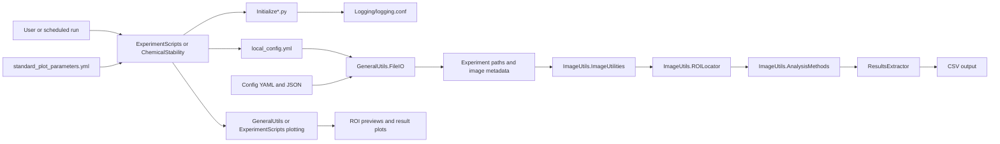

# GuidedModeResonanceAnalysis architecture

## Scope

`GuidedModeResonanceAnalysis` processes guided-mode resonance image data. Its workflow is
organized around configuration and metadata discovery, image loading, ROI
selection, numerical analysis, and result generation.

## Component flow

## Directory responsibilities

### `Config/`

Stores the default user configuration, chemical-stability configuration, and
sensor-specific geometry and grating data. `FileIO.py` validates the YAML
configuration with Pydantic and loads the sensor-specific JSON data when ROI
processing starts.

### `GeneralUtils/`

`FileIO.py` is the central state and filesystem layer. It provides:

- configuration models and enum validation;
- measurement-directory discovery and date lookup;
- image metadata creation and loading;
- sensor feature loading;
- ROI file management; and
- CSV result extraction for Gaussian, Fano, and hybrid analyses.

`Plotting.py` provides shared ROI visualization helpers. The initialization
script configures the GMR logging hierarchy before these utilities are used.

### `ImageUtils/`

`ImageUtilities.py` loads images and normalizes them for analysis. Its analysis
pipeline calls the functions in `AnalysisMethods.py`, which provide maximum
intensity, centre, Gaussian, Fano, RMSE, and hybrid fitting operations.

`ROILocator.py` defines the base ROI locator contract and the IMEC-specific
implementation. The locator methods are extension points for chip-feature,
grating, angle, and ROI location logic.

### `DataUtils/`

Contains data-processing helpers used by the experiment scripts. It sits
between workflow orchestration and lower-level image or result utilities when
additional data transformations are required.

### `ExperimentScripts/`

`TimeExperiment.py` is the main time-dependent workflow. It loads
`PHOREST_DATA_ROOT`, discovers measurement directories, creates or reloads
image configurations, and coordinates the image and result pipeline.

`InitializeScripts.py` adds `GuidedModeResonanceAnalysis` to the import path and configures
the logging file with the current date and log directory.

### `ChemicalStability/`

Provides the chemical-stability workflow entry points. The wrapper loads
`CHEMICAL_STABILITY_DATA_ROOT`, shared plotting parameters, and the chemical-
stability configuration. Processing and plotting modules currently establish
their imports and logging but remain under development.

### `Logging/`

Owns the GMR logging configuration and log cleanup command. Logs are written
to the console and to daily rotating `application_<date>.log` files. The
cleanup command retains files containing `ERROR`, `WARNING`, `FAILURE`, or
`FAILED` markers and can preview deletions with `--dry-run`.

## Configuration and data flow

1. A workflow reads the ignored repository-local `local_config.yml` file for a
   machine-specific data root. Create it from `local_config.example.yml`.
2. `ExperimentalConfiguration` or `ChemicalStabilityConfiguration` combines
   that root with the configured experiment and results directories.
3. `FileIO.py` discovers measurements, loads default configuration, and builds
   image metadata and per-image configuration.
4. Image utilities load the source image, locate or load ROIs, and apply the
   selected analysis method.
5. `ResultsExtractor` writes model-specific statistics and shared metadata to
   CSV, while plotting helpers write visual previews and result figures.

## Known incomplete areas

The IMEC ROI locator methods are extension points and are not fully
implemented. `get_image_ROIs()` and parts of the time-experiment processing
and plotting flow also remain under development. Chemical-stability processing
and plotting functions are currently entry-point scaffolding.
